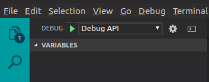
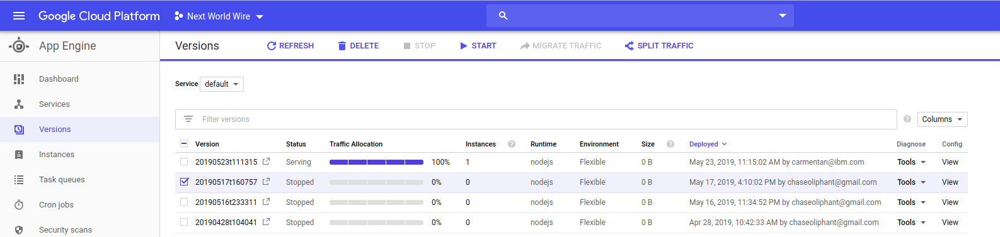
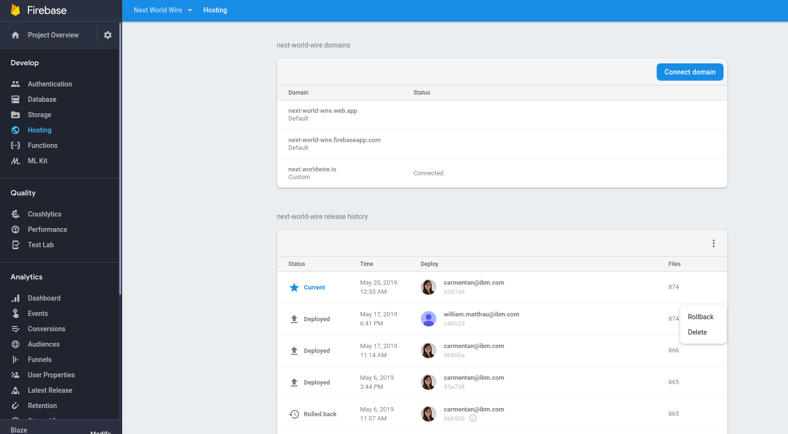

**TODO:** add travis build badge here...

# 🦄 Sample Project

> Sample code to build a `web app` supported by a `client API` and `admin API` using:  
 * nodejs 
 * angular 
 * carbon-design
 * TSOA
 * travis
 * firebase
 * gcloud KMS
 * gcloud App Engine

# Overview

This code repository includes both a front-end web portal and a back-end API server to service the portal. This code is not intended for use with production systems and is meant to be used for illustrative purposes only. The front-end web portal related code can be found in the `root` of the code repository and is structured as a standard angular projects.   

The back-end API server code is located in the `/apis/...` directory and is a NodeJs application written in Typescript. The `/apis/client/src/..` directory contains the development build code. The `/apis/client/lib/..` directory contains the transpiled javascript code. The `/apis/client/def/..` directory contains the generated swagger definitions. 

# Front-end / Web Portal

## Architecture
The front-end has been built in Angular as a Single Page Application (SPA), see https://angular.io/guide/architecture. 

Benefits include:
- Supported by style frameworks like IBM Carbon Design, Material Design, or Twitter Bootstrap
- Lightweight - fast and responsive UI
- Advanced Caching enabling off-line capabilities
- Takes advantage of modern browser technology


This project was generated with [Angular CLI](https://github.com/angular/angular-cli) version 7.3.8.  
To get more help on the Angular CLI use `ng help` or go check out the [Angular CLI README](https://github.com/angular/angular-cli/blob/master/README.md).

## Dependencies 

***Step 1:***  
This application requires NodeJs, follow [install NodeJS instructions here.](https://nodejs.org/en/)

***Step 2:***  
```shell
# After cloning the repo run the following from the root directory this project
$ npm i # project deps
$ npm i -g @angular/cli typescript firebase-tools # global deps
```

## Environment Variables & Secrets

***Environment variables*** and ***Secrets*** are not the same same. Differences explained:

- ENVIRONMENT VARIABLES  
    include non-sensitive configuration logic, for example the env var "build" might assigned a value of "production" or "development". This information, if leaked, is far less likely to be exploited by a malicious person. These values are often stored in plain text and can be persisted in memory (in the application's memory or OS level storage).

- SECRETS  
    require special care when retrieving and storing. Examples of a secrets includes encryption keys, connection strings, passwords, and certificates. Secrets, if leaked, could be exploited by a malicious person to cause harm.    

**IMPORTANT**: precautions should be taken when setting environment variables. Limit the surface of attack by employing the following:

- ASYMMETRIC VS. SYMMETRIC:  
    Asymmetric vs. Symmetric encryption is explained [here](https://www.youtube.com/watch?v=AQDCe585Lnc). Many factors impact the decision whether to choose asymmetric or symmetric encryption discussed [here](https://security.stackexchange.com/a/7226). As a rule of thumb, asymmetrical encryption is preferable when the client decrypting the data does not trust the client encrypting the data but the down side is that asymmetrical encryption often require more computational power when compared to symmetric encryption. Additionally, AES symmetrical encryption may be more resistant to Quantum attacks in the future, see [here](https://security.stackexchange.com/a/56688).

- ALGORITHMS:
    This depends on the use case, but in general the following algorithms provide good coverage for a wide variety of use cases: 
     - AES-256 for symmetrical encryption
     - RSA-256 with SHA-256 digest for asymmetrical encryptions
     - ECDSA with SHA-256 digest for asymmetrical signing 
    More details regarding the algorithms [purpose here](https://cloud.google.com/kms/docs/algorithms#key_purposes)   

- SECRETS AS A MANAGED SERVICE vs. OPENSSL / LOCAL LIBRARY:  
    OpenSSL and libraries like the Nodejs Crypto Module will perform symmetrical and asymmetrical encryption. However, managed services provide additional security features that can be taken advantage of. Keys are not exportable from Cloud KMS by design. All encryption and decryption with these keys must be done within Cloud KMS. This helps prevent leaks and misuse, and enables Cloud KMS to emit an audit trail when keys are used. Permissions to encrypt and decrypt are limited by IAM policies.
    
- SHARING:   
    Environment variables should **NOT** be pushed up to github (or other cloud based code repositories). Secrets should only be stored on encrypted and password protected drives. Sharing of "production" related secrets should be limited to individuals who need them. Ideally, secrets should be shared via encrypted and password protected flash drives. However, this is not always feasible during development with teams dispersed geographically. As an alternative method, secrets can be shared via encrypted emails using password protected spreadsheets.

- HSMs:  
    [Cloud HSM](https://cloud.google.com/kms/docs/hsm) is a cloud-hosted Hardware Security Module (HSM) service that allows you to host encryption keys and perform cryptographic operations in a cluster of FIPS 140-2 Level 3 certified HSMs. Google manages the HSM cluster for you, so you don't need to worry about clustering, scaling, or patching.   

- IN MEMORY vs. ON DEMAND:  
    **DO NOT** store secrets in OS/Application level memory. Secrets should be retrieved on demand from a persisted encrypted source like a storage solution (aka: storage bucket). This helps to prevent the accidental leaking of secrets as a result of a vulnerability in the image, application, or OS.    

- SEPARATION OF DUTIES:  
    Separation of duties is the concept of ensuring that one individual does not have all necessary permissions to be able to complete a malicious action. 

    The following explains how this can be accomplished in gcloud [Separation of duties](https://cloud.google.com/kms/docs/separation-of-duties):   
    Cloud KMS could be run in an existing project, for example your-project, and this might be sensible if the data being encrypted with keys in Cloud KMS is stored in the same project. However, any user with owner access on that project is then also able to manage (and perform cryptographic operations with) keys in Cloud KMS in that project. This is because the keys themselves are owned by the project, of which the user is an owner.

- KEY ROTATION:   
    Keys should have a rotation schedule which determines if and when it is automatically rotated. This should occur more frequently than Secret Rotation. Gcloud KMS can automatically handle this functions, explained here [Rotating Keys](https://cloud.google.com/kms/docs/rotating-keys)

- SECRET ROTATION:  
    Secrets should be rotated periodically in additions to keys. Secrets are the underlying plain text access credentials whereas keys are used in the encryption process. 

- CI/CD ENCRYPTION:  
    Additional encryption (additional to the encryption process above) should be taken when deploying in a CI/CD pipeline. Travis enables the use of encryption for environment variables described here - [Travis encryption](https://docs.travis-ci.com/user/encryption-keys/#usage). 
 

## Development server

Run `ng serve` for a dev server. Navigate to `http://localhost:4200/`. The app will automatically reload if you change any of the source files.

## Code scaffolding

Run `ng generate component component-name` to generate a new component. You can also use `ng generate directive|pipe|service|class|guard|interface|enum|module`.

## Build

Run `ng build` to build the project. The build artifacts will be stored in the `dist/` directory. Use the `--prod` flag for a production build.

## Testing 

See Angular Testing docs here [Angular Testing](https://angular.io/guide/testing).

### Running unit tests

Run `ng test` to execute the unit tests via [Karma](https://karma-runner.github.io).

### Running end-to-end tests

Run `ng e2e` to execute the end-to-end tests via [Protractor](http://www.protractortest.org/).

# Back-end / API Server

The back-end api server for this project is built using NodeJs, Typescript, TSOA, and Firebase Real-time Database.

## Architecture (TSOA)
This back-end is written in NodeJs. See https://github.com/lukeautry/tsoa. TOSA must be installed globally using `npm i -g tsoa`. TSOA auto-generates swagger definitions using the cmd `tsoa swagger`and outputs at `/apis/def/..` directory. The cmd `tsoa routes` auto-generates the routes and outputs `/apis/src/routes.ts`.

Methodology  explained...  
see https://www.youtube.com/watch?v=CccZCy4eth4,  
and https://www.youtube.com/watch?v=Tng6Fox8EfI
<!-- and https://www.youtube.com/watch?v=o_TH-Y78tt4 -->

## Install Dependencies 

*Step 1:*  
This application requires NodeJs, follow [install NodeJS instructions here.](https://nodejs.org/en/)

*Step 2:*  
```shell
# After cloning the repo run the following from the ./functions directory
$ cd functions # change directory
$ npm i # project deps
$ npm i -g tsoa typescript firebase-tools mocha chai ts-node # global deps
```

## Running development 

To debug select the appropriate option from the debug menu in vscode, simply click the play button in vscode for your selected build option, ie: to build for development click `debug NAME api` - see screenshot below. 



These options are defined in `.vscode/launch.json` and related *pre* and *post* scripts are defined in `.vscode/tasks.json`.

## Testing 

### Run tests from shell
```shell
$ cd functions
$ npm run test
```

### Debug tests in VS Code
Set a breakpoint in the `apis/API_NAME/src/app.spec.ts` file. Select `test NAME api` from the debug menu in VS Code and click the play button. 

# Deployment
As a best practice - both the front-end and back-end should be deployed at the same time should occur at the same time after all tests and builds have *passed*. This process will help to ensure compatibility across the platform.

## Automated (via Continuous Integration using Travis/Github) 
Releases are created upon each 
Requires the travis cli, install with `$ npm i -g travis cli`. and firebase ci token can be generated via `$ firebase login:ci`, see setup instructions here: https://docs.travis-ci.com/user/deployment/firebase/ 

Travis allows encrypting files for your deployment. The project encrypts the .credentials/** file so that the 
travis has encrypted credentials that allow test to run and travis to manage deployments. See `./travis-setup`
and launch.json config `debug travis-setup`.

## Manual (not recommended)
The deployment configuration for the front-end is a single click process defined in the .vscode/launch.json. Similar process for deploying the back-end API. See above [Running development server and Deployment](#running-development-server-and-deployment)  
Environment variables will be set via automated deployment via travis account and should be consistent with the structure of env vars needed. See more at [Environment Variables](#environment-variables).

## Rollback  
Rollbacks can easily be accomplished for back-end and front-end.  

### Back-end Rollback & Canary Deployment
Rollbacks & Canary Deployments are easily configured in gcloud app-engine cloud console via the ui in the screenshot below. Simple start and stop the version(s), you would like to run. Each subsequent deployment to gcloud will be displayed as a new version in the ui.   


### Front-end Rollback
Front-end rollback are also just as easy. Simply login to firebase, select the project, and select *Hosting*, then click *Rollback* on the version you would like to rollback too.

